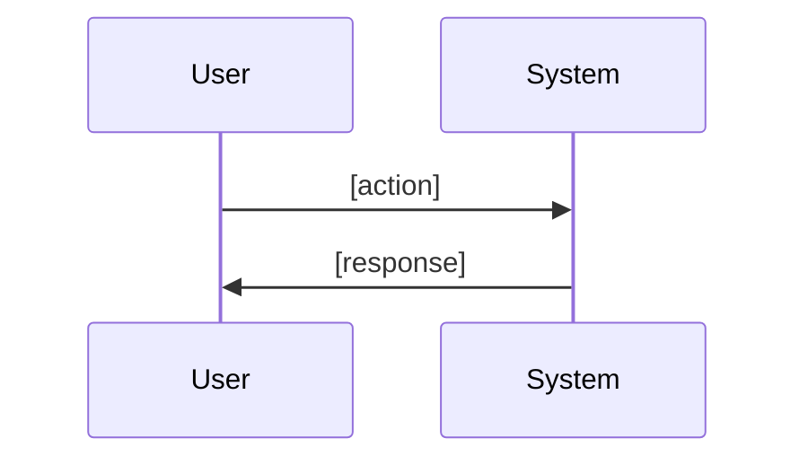
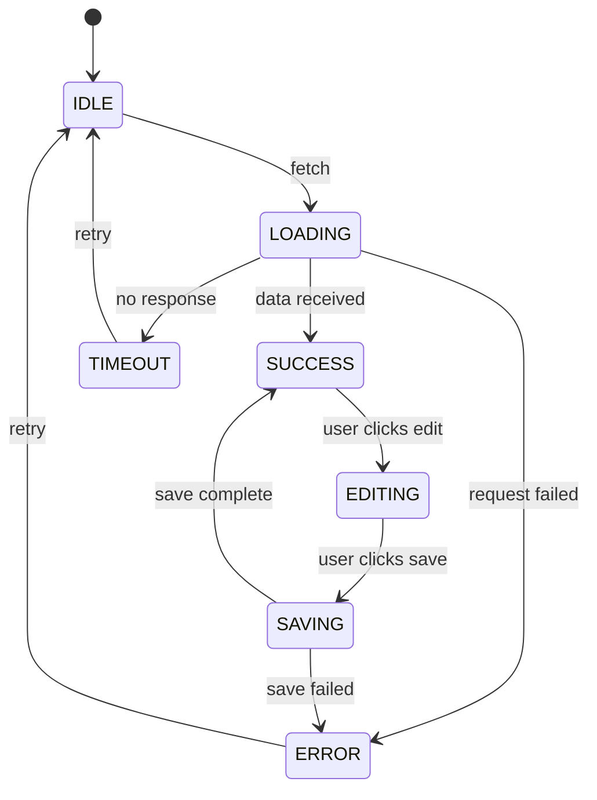

# CodeBrain Map Journeys

Systematic user journey enumeration and edge case discovery. The phase that prevents "it works in the demo but breaks in production."

## Usage

`/codebrain:map-journeys [epic-slug or PRD path]`

## Why This Exists

Prototypes handle the happy path. Production handles EVERY path. The gap between these is why MVPs stay as MVPs. This skill forces you to enumerate every state, transition, and error BEFORE writing code — when fixing is cheap (change a spec) vs expensive (refactor code).

## Workflow

### Step 1: Load the PRD

1. Read the PRD (`.codebrain/epics/{slug}/prd.md` or provided path).
2. Extract all user stories and acceptance criteria.
3. Read `.codebrain/memory/constitution.md` for principles.

### Step 2: Enumerate Happy Paths

For each user story, trace the ideal flow:

```markdown
## Happy Path: [User Story Title]

**Entry:** [How the user arrives — URL, button click, API call]
**Steps:**
1. User [action]
2. System [response]
3. User [action]
4. System [response]
**Exit:** [What state the user is in when done]
**Data changed:** [What was created/updated/deleted]
```

Generate a Mermaid sequence diagram for each:


### Step 3: Enumerate Sad Paths

For each happy path step, ask: "What if this goes wrong?"

**Common sad paths to check:**
- **Authentication:** Not logged in, expired session, wrong permissions
- **Validation:** Missing required fields, wrong format, too long/short, special characters
- **Network:** Timeout, connection lost mid-operation, slow connection
- **Concurrency:** Two users editing the same resource, race conditions
- **Empty states:** No data yet, all items deleted, search returns nothing
- **Rate limits:** Too many requests, quota exceeded
- **Payment:** Card declined, subscription expired, free tier limit

For each sad path:
```markdown
## Sad Path: [Description]

**Trigger:** [What goes wrong]
**Current behavior:** [What happens now — probably nothing or a crash]
**Expected behavior:** [What SHOULD happen]
**User sees:** [Error message, redirect, or recovery flow]
**System state:** [What happens to data — rolled back? Partially saved?]
```

### Step 4: Model as State Machine

Convert the feature into a finite state machine:

```markdown
## State Machine: [Feature Name]

### States
| State | Description | Valid Transitions |
|-------|-------------|-------------------|
| IDLE | No action in progress | → LOADING |
| LOADING | Fetching data | → SUCCESS, → ERROR, → TIMEOUT |
| SUCCESS | Data loaded | → IDLE, → EDITING |
| ERROR | Operation failed | → IDLE (retry), → ERROR_DETAIL |
| EMPTY | No data exists | → CREATING |
| EDITING | User modifying data | → SAVING, → IDLE (cancel) |
| SAVING | Write in progress | → SUCCESS, → ERROR |
| TIMEOUT | Operation timed out | → IDLE (retry) |

### Impossible States (structurally prevented)
- Cannot be LOADING and ERROR simultaneously
- Cannot be SAVING without prior EDITING
- Cannot transition from SUCCESS to ERROR without going through IDLE first
```

Generate a Mermaid state diagram:


### Step 5: Edge Case Inventory

Systematically check these categories:

**Data Edge Cases:**
- [ ] Empty string input
- [ ] Maximum length input (what's the limit?)
- [ ] Unicode / emoji / RTL text
- [ ] HTML/script injection in text fields
- [ ] Extremely large numbers
- [ ] Negative numbers where only positive expected
- [ ] Zero
- [ ] null / undefined
- [ ] Duplicate entries
- [ ] Very long lists (1000+ items)

**Timing Edge Cases:**
- [ ] Double-click / double-submit
- [ ] Action during loading state
- [ ] Browser back button during operation
- [ ] Tab closed during save
- [ ] Session expires during form fill
- [ ] Simultaneous edits by multiple users

**Environment Edge Cases:**
- [ ] Mobile viewport
- [ ] Slow network (3G)
- [ ] No network (offline)
- [ ] Browser with JavaScript disabled
- [ ] Screen reader / accessibility
- [ ] Dark mode / light mode

**Business Logic Edge Cases:**
- [ ] First-time user (no data)
- [ ] Power user (maximum data)
- [ ] Free tier hitting limit
- [ ] Admin vs. regular user
- [ ] Deleted/archived items referenced elsewhere

For each edge case found, note the handling strategy: **prevent** (make it impossible), **handle** (show appropriate UI), or **accept** (document as known limitation).

### Step 6: Pre-Mortem

Assume the feature has ALREADY failed in production. Work backward:

1. **"Users are complaining about..."** — What would they complain about?
2. **"The system crashed because..."** — What data or state caused it?
3. **"We had to roll back because..."** — What regression did we introduce?
4. **"Nobody is using the feature because..."** — What UX problem did we miss?
5. **"Security incident because..."** — What attack vector did we not consider?

Document each failure scenario and its prevention strategy.

### Step 7: Generate Journey Map Document

```markdown
# User Journey Map: [Feature Name]

**PRD:** [link to PRD]
**Date:** [today]

## Happy Paths
[Mermaid diagrams + step-by-step flows]

## Sad Paths
[Error scenarios with expected handling]

## State Machine
[State diagram + transition table + impossible states]

## Edge Case Inventory
[Categorized checklist with handling strategy for each]

## Pre-Mortem Results
[Failure scenarios and prevention strategies]

## Coverage Summary
| Category | Total Found | Handled | Accepted | Needs Decision |
|----------|-------------|---------|----------|----------------|
| Happy paths | N | N | 0 | 0 |
| Sad paths | N | N | N | N |
| Edge cases | N | N | N | N |
| Pre-mortem | N | N | N | N |
```

### Step 8: Persist & Next Steps

- Save to `.codebrain/epics/{slug}/journeys.md` via MCP tools
- For edge cases marked "Needs Decision": present to user with `[NEEDS CLARIFICATION]` markers
- Suggest next: `/codebrain:epic create` (tickets will incorporate edge case handling from this document)

## Integration with Linear

If Linear MCP is available:
- Create Linear issues for each unhandled sad path and edge case
- Tag them with "edge-case" or "error-handling" labels
- Link back to the journey map document

## Rules

- **Every happy path step gets a sad path check.** No exceptions.
- **State machines must define impossible states.** If you can't name what's impossible, you haven't modeled it.
- **Edge cases get a handling strategy.** Prevent, handle, or accept — but never ignore.
- **Pre-mortem is mandatory.** Assume failure, work backward.
- **Mermaid diagrams for every flow.** Visual representation catches gaps that text misses.
